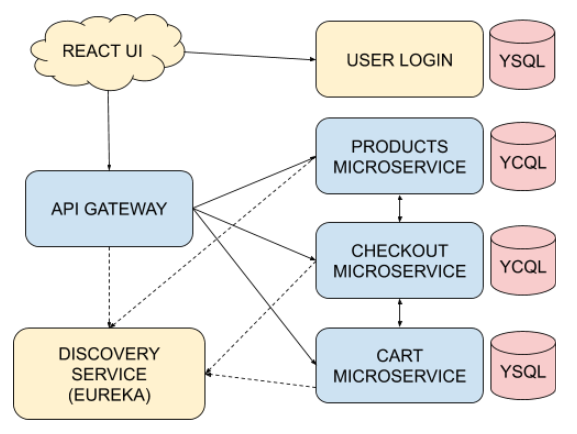

# Yugastore in Java

This is an implementation of a sample ecommerce app. This microservices-based retail marketplace or eCommerce app is composed of **microservices written in Spring (Java)**, a **UI based on React** and **YugabyteDB as the distributed SQL database**.

If you're using this demo app, please :star: this repository! We appreciate your support.

## Trying it out

This repo contains all the instructions you need to [run the app on your laptop](#building-the-app).

You can also [try the app out](https://yugastore-ui.cfapps.io/) online, it is hosted on [Pivotal Web Services](https://run.pivotal.io/).

# Features

* Written fully in Spring
* Desgined for multi-region and Kubernetes-native deployments
* Features 6 microservices
* Uses a discovery service that the microservices register with
* Sample data has over 6K products in the store

## Architecture

The architecture diagram of Yugastore is shown below.




| Microservice         | YugabyteDB API | Default host:port | Description           |
| -------------------- | ---------------- | ---------------- | --------------------- |
| [service discovery](https://github.com/yugabyte/yugastore-java/tree/master/eureka-server-local) | - | [localhost:8761](http://localhost:8761) | Uses **Eureka** for localhost. All microservices register with the Eureka service. This registration information is used to discover dynamic properties of any microservice. Examples of discovery include finding the hostnames or ip addresses, the load balancer and the port on which the microservice is currently running.
| [react-ui](https://github.com/yugabyte/yugastore-java/tree/master/react-ui) | - | [localhost:8080](http://localhost:8080) | A react-based UI for the eCommerce online marketplace app.
| [api-gateway](https://github.com/yugabyte/yugastore-java/tree/master/api-gateway-microservice) | - | [localhost:8081](http://localhost:8081) | This microservice handles all the external API requests. The UI only communicates with this microservice.
| [products](https://github.com/yugabyte/yugastore-java/tree/master/products-microservice) | YCQL | [localhost:8082](http://localhost:8082) | This microservice contains the entire product catalog. It can list products by categories, return the most popular products as measured by sales rank, etc.
| [cart](https://github.com/yugabyte/yugastore-java/tree/master/cart-microservice) | YSQL | [localhost:8083](http://localhost:8083) | This microservice deals with users adding items to the shopping cart. It has to be necessarily highly available, low latency and often multi-region.
| [checkout](https://github.com/yugabyte/yugastore-java/tree/master/checkout-microservice) | YCQL | [localhost:8086](http://localhost:8086) | This deals with the checkout process and the placed order. It also manages the inventory of all the products because it needs to ensure the product the user is about to order is still in stock.
| [login](https://github.com/yugabyte/yugastore-java/tree/master/login-microservice) | YSQL | [localhost:8085](http://localhost:8085) | Handles login and authentication of the users. *Note that this is still a work in progress.*

# Build and run

To build, simply run the following from the base directory:

```
$ mvn -DskipTests package
```

To run the app on host machine, you need to first install YugabyteDB, create the necessary tables, start each of the microservices and finally the React UI.

## Running the app on host

Make sure you have built the app as described above. Now do the following steps.

## Step 1: Install and initialize YugabyteDB

You can [install YugabyteDB by following these instructions](https://docs.yugabyte.com/latest/quick-start/).

Now create the necessary tables as shown below. Note that these steps would take a few seconds.

```
$ cd resources
$ cqlsh -f schema.cql
```
Next, load some sample data.

```
$ cd resources
$ ./dataload.sh
```

Create the postgres tables in `resources/schema.sql` for the YSQL tables.

## Step 2: Start the Eureka service discovery (local)

You can do this as follows:

```
$ cd eureka-server-local/
$ mvn spring-boot:run
```

Verify this is running by browsing to the [Spring Eureka Service Discovery dashboard](http://localhost:8761/).

## Step 2: Start the api gateway microservice

To run the products microservice, do the following in a separate shell:

```
$ cd api-gateway-microservice/
$ mvn spring-boot:run
```


## Step 3: Start the products microservice

To run the products microservice, do the following in a separate shell:

```
$ cd products-microservice/
$ mvn spring-boot:run
```

## Step 4: Start the checkout microservice

To run the products microservice, do the following in a separate shell:

```
$ cd checkout-microservice/
$ mvn spring-boot:run
```

## Step 5: Start the checkout microservice

To run the cart microservice, do the following in a separate shell:

```
$ cd cart-microservice/
$ mvn spring-boot:run
```

## Step 6: Start the UI

To do this, simply run `npm start` from the `frontend` directory in a separate shell:

```
$ cd react-ui
$ mvn spring-boot:run
```

Now browse to the marketplace app at [http://localhost:8080/](http://localhost:8080/).

# Running the app in docker containers

The dockers images are built along with the binaries when `mvn -DskipTests package` was run.
To run the docker containers, run the following script, after you have [Installed and initialized YugabyteDB](#step-1-install-and-initialize-yugabyte-db):

```
$ ./docker-run.sh
```
Check all the services are registered on the [eureka-server](http://127.0.0.1:8761/).
Once all services are registered, you can browse the marketplace app at [http://localhost:8080/](http://localhost:8080/).

